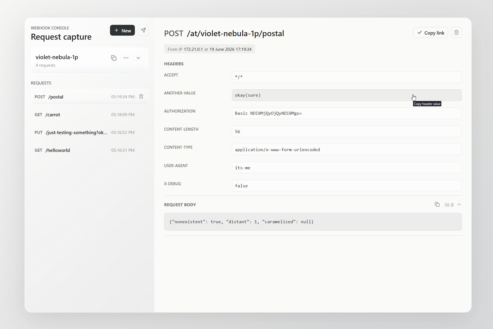

# Webhook Console

Self-hosted request capture service. It creates human-readable webhook URLs such as `/at/lunar-meteor-a7`, stores incoming request headers, body, method, path, query string, and client IP, and exposes captured requests on the dashboard. Guest access can be enabled per webhook with a share link.



## Quick Start

1. Create an env file:

   ```sh
   cp .env.example .env
   openssl rand -hex 32
   ```

   Put the random value in `APP_SECRET`, set a strong `POSTGRES_PASSWORD`, and set `PUBLIC_BASE_URL` to your webhook subdomain.

2. Run it:

   ```sh
   docker compose up -d --build
   ```

3. Open `http://localhost:8080` for local testing, or your `PUBLIC_BASE_URL` behind nginx.

## Nginx

Use [configs/nginx/webhook-site.conf](configs/nginx/webhook-site.conf) as a starting point. The important pieces are:

- `webhook.example.com` proxies to the app container port.
- `example.com/webhook/<data>` redirects to `https://webhook.example.com/<data>`.
- Forwarded headers are set so the app can build HTTPS links and record the original client IP.

If your root domain already has a server block, copy only the two `/webhook` locations into that existing block.
